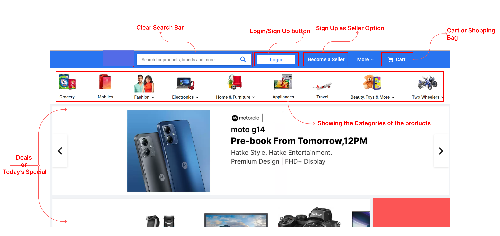
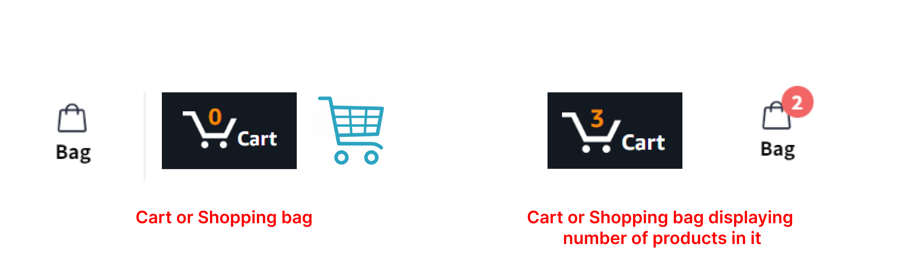
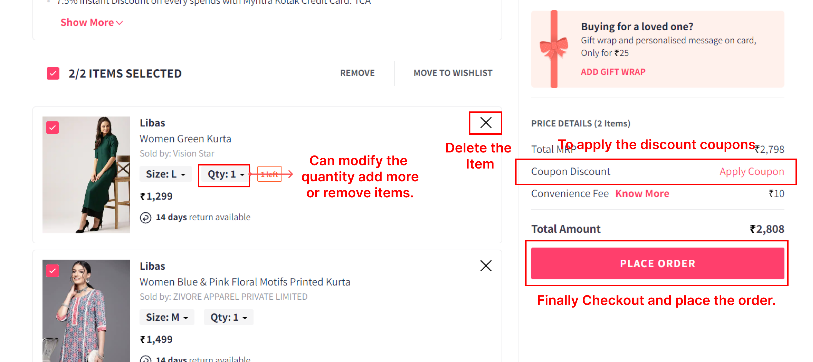
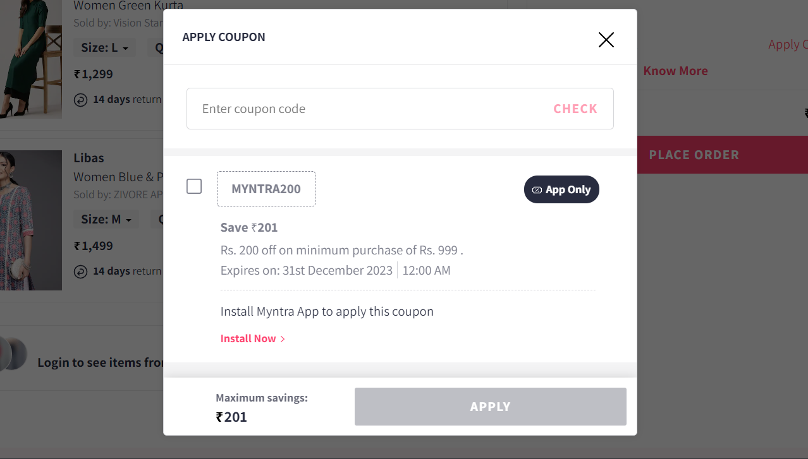
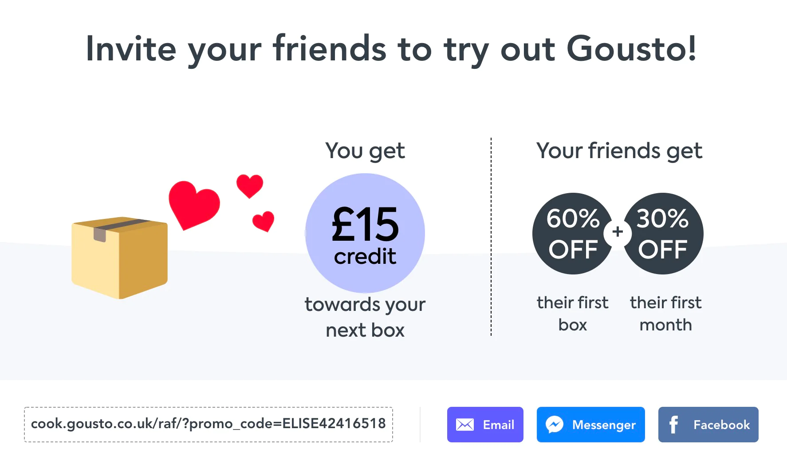
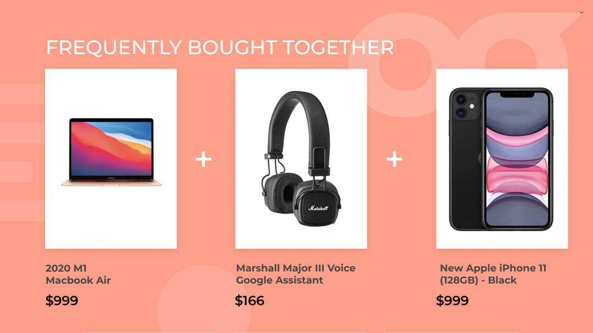
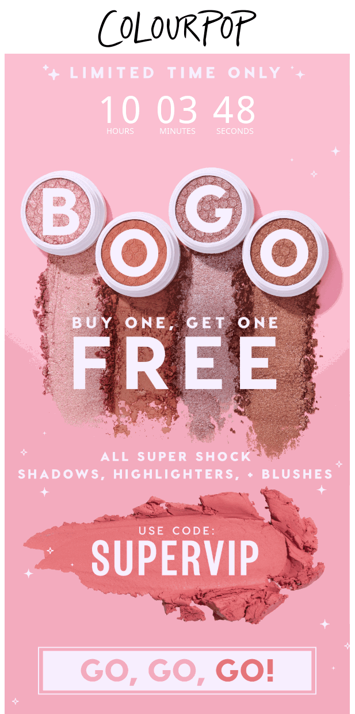
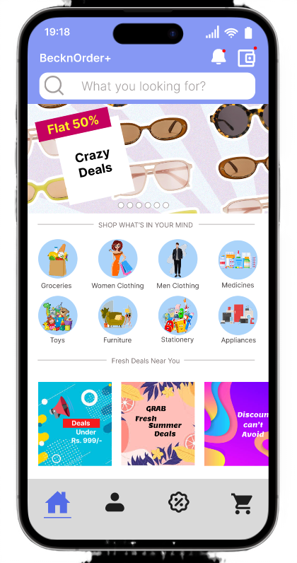

# Order Building Block
This is a Research Work done to enhance the UI/UX of the BecknOrder+, by analyzing and gaining insights of the various aspects of both common and uncommon e-commerce website to enhance the online Shopping Experience.

## UI/UX Research on E-Commerce Websites
An E-Commerce website or app is a digital platform that faciliates the online buying and selling of products of different categories involving groceries, clothes, footwear, electronic devices and many more items all curated in one place.

These platforms enables the buisness or seller to showcase their products or services to the global audience and allowing buyers to browse, select and purchase items from the comfort of their home.

Here are some key functionalities that are essential for e-commerce websites for buyer and seller as well:

- **User Accounts** : Here, the buyers and sellers can  create their accounts, for the sellers to showcase their product catalogue, recieve orders, update orders and many more. For the buyers to view the product, select and order it, track the orders and etc.

- **Search and Filter** :  Users can search for specific products or use filters to refine their search results based on different criteria like price range, brand, size, etc.

- **Customer Reviews and Ratings** : Users can leave feedback and ratings for products or sellers, which helps others make informed decisions.

- **Customer or Seller Support** : To provide the smooth experience its essential to provide the support to customers/sellers on their concern or complaints  through chat, email, or phone to address them.

- **Secure Payment Gateway** : e-Commerce platforms integrate secure payment gateways that enable users to make online payments using various methods, such as credit cards, debit cards, digital wallets, or other electronic payment options. And creating the secure payment to the sellers as well.

There are various other aspects which play essential role in an e-commerce platform and would be researching throughout the article.

### Landing Page for the E-Commerce Platform

The primary goal of the e-commerce platform's landing page is to convert the visitors into the potential customers. It should not flooded with lots of thing it should contain specific decided things to target the users to make the desired action, it should promote clarity and simplicity.
Like they should have product catogries so that user can select it, browse the products, select the product and make the order. Cart functionality on the top so that user can find it easily and manage thier orders.

The different essential components of the e-commerce websites:

1. **Product Category Display** : Categorizing products makes it easier for customers to find what they are looking for. It organizes products into logical groups, reducing the effort required to navigate through a vast product catalog. A well-structured category display enhances user experience and encourages visitors to explore more products. 

1. **Cart Functionality** : It refers to the capability of the platform to allow users to add products to a virtual shopping cart as they browse and shop for items. It should be clear icon visible from every screen in the platform so that user can jump into whenever they want to place or manage the products in the cart. The cart or shopping bag's symbol should be clear and concise. It should show the number of items added in the cart, so that user can see how many items they have added.

They can checkout to the cart perform order managment like increasing the quantity of the item, deleting the particular item and can save cart for later and finally place the order.

1. **Different Screens of E-Commerce Platform** : The goal of different checkout screens is guide the users whether to login/sign-up, purchase product and many more. There are various checkout screens which are as follows : 
- _Login/Sign Up_ 

- _Order Management_

- _Notifications of Order/Shipping/Delievery Information_

- _Loyalty Points collection and to Redeem it_

- _User Profile_

- _Discounts/Deal section_

- _Cart/Shopping Bag_

4. **Discount and Coupon Startegies**: Coupons and discounts play a crucial and multifaceted role in e-commerce platforms, benefiting both customers and businesses, it helps in _Customer Attraction and Acquisition_.

There are various discount strategies that can be used for the growth of D2C, and are as follows:

- _First Time Shopper Discount_ : It helps to  significantly impact customer acquisition and long-term business success, as it helps in reducing the purchase barrier new customers might be hesitant to buy from an unfamiliar online store, but a special discount or promotion can provide the extra motivation needed to try out the platform. Almost all the platforms from food delievery to shopping uses first time shopper discount to get the user/customer onboard.

- _Refral Discount Codes_ : It is highly effective marketing strategy with numerous benefits.It basically comes under word-of-mouth marketing, referral discounts often lead to higher conversion rates. New customers who come through referrals are more likely to make a purchase because they already have trust in the recommendation and have some extra discount to make the first order. Referral programs can offer personalized incentives to both referrers and referees, making the offer more relevant and appealing to each individual.

- _Product bundling offers_ : Product bundling encourages customers to purchase more items together in a single transaction. By offering related or complementary products as a bundle, the platform can increase the average order value, leading to higher revenue per customer. And can be helpful for promoting new products and provding them comparance with three products individual vs three in bundle and highlighting the difference, we can make the customers to buy three products where they came to buy just one.

- _Flash sale offers_ : Providing flash sale offers on an e-commerce platform is important for several reasons, as it can create a sense of urgency and excitement among customers, leading to increased sales and other valuable outcomes. It creates a sense of urgency and scarcity. Customers are more motivated to make a purchase immediately to secure the deal before it expires or runs out of stock. Customers who may have been hesitant to make a purchase before are incentivized to do so during the flash sale period. It also helps in promotion of specific products, creating buzz and excitemnet and analyzing the customer insights.

- _Customer Loyalty Points_ : Customer loyalty points can act as a essential for the several e-commerce because customer loyalty points incentivize customers to return to the e-commerce platform for future purchases. When customers earn points with every purchase, they are more likely to come back to redeem those points, leading to increased retention rates and repeat business.

